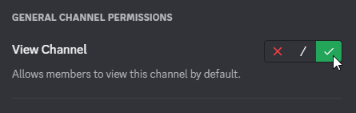

# Troubleshooting

Here are a list of common issues and errors you might find while using our bots, along with step-by-step instructions on how to fix them.

## "I need the **View Channel** and **Send Messages** permissions in this channel." {#no-view-or-send-permission}

### Why this happened {#no-view-or-send-permission-explanation}

This error typically occurs when the bot lacks the **View Channel** and/or **Send Messages** permissions in the channel that you ran the command in.

:::note

This error specifically points to the channel that you ran the command in, and not the channel that the bot is trying to connect to (if applicable).

:::

### How to fix this {#no-view-or-send-permission-fix}

1. Hover over the channel name in the left sidebar, and click the **Edit Channel** button.

    

2. Click the **Permissions** tab.

    

3. Scroll down to **Advanced permissions**, and click on the **+** button next to "Roles/Members".

    

4. In the pop-up, search for the bot's name, and click on it to give it a "Permission Override".

    

5. Under **General Channel Permissions**, enable the **View Channel** permission.

    

6. Under **Text Channel Permissions**, enable the **Send Messages** permission.

    

    :::note

    If you are running the command in a "Voice Channel Chat", the permission will be found under **Voice Channel Chat Permissions**.

    

    :::

7. Click the **Save Changes** button.

    

## "I need the **Connect** and **Speak** permissions in the voice channel." {#no-connect-or-speak-permission}

### Why this happened {#no-connect-or-speak-permission-explanation}

This error typically occurs when the bot lacks the **Connect** and/or **Speak** permissions in the voice/stage channel that it's trying to join.

:::note

This error specifically points to the voice/stage channel that it's trying to join (most likely the channel you're in), and not the channel that the command is being run in.

:::

### How to fix this {#no-connect-or-speak-permission-fix}

1. Hover over the channel name in the left sidebar, and click the **Edit Channel** button.

    

2. Click the **Permissions** tab.

    

3. Scroll down to **Advanced permissions**, and click on the **+** button next to "Roles/Members".

    

4. In the pop-up, search for the bot's name, and click on it to give it a "Permission Override".

    

5. Under **Voice Channel Permissions**, enable the **Connect** and **Speak** permissions.

    

6. Click the **Save Changes** button.

    
